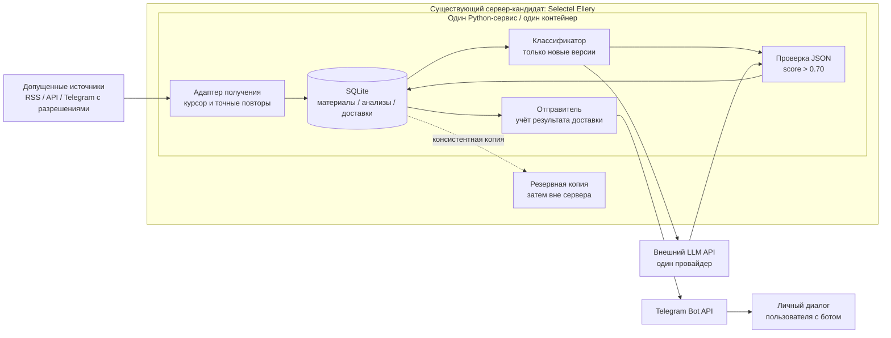
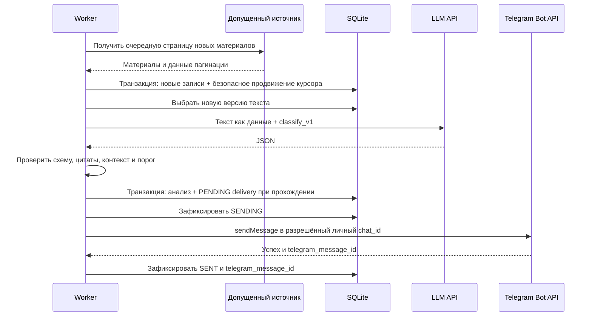
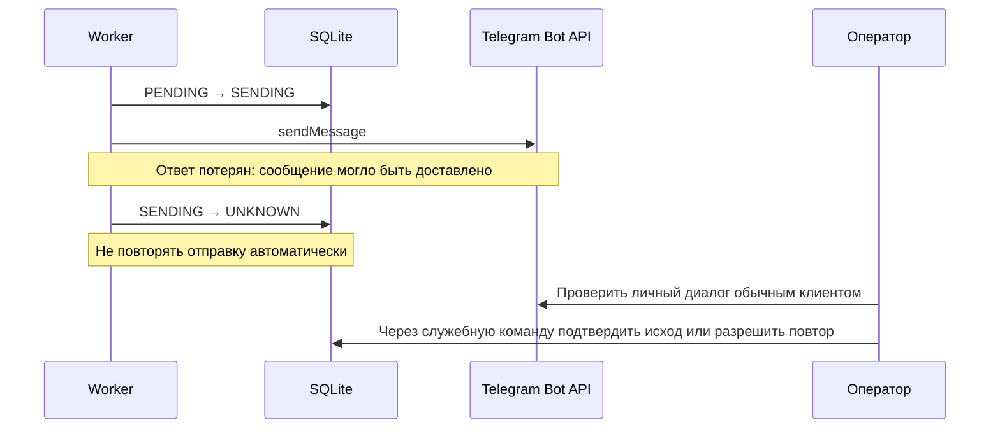
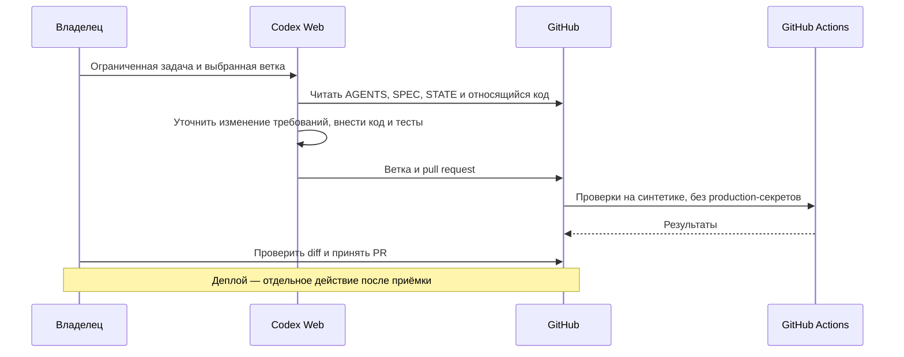

# Архитектура 0.1

Проектная схема, не схема уже развёрнутого приложения. Диаграммы записаны в Mermaid для версионирования рядом с кодом.

## Компоненты

Справочник допускает несколько типов источников, но в первом live-проходе реализуется **один** тип. Telegram Bot API для доставки не означает наличие доступа к чужим каналам для чтения.

Веб-сервер, публичные входящие порты, домен, webhook, очередь сообщений как отдельный сервис и локальная LLM для этой схемы не требуются. Сеть нужна для разрешённых исходящих API-вызовов. При появлении входных updates их получение — функция того же приложения.

## Успешный проход

## Неопределённый исход отправки

Равным образом обрабатывается падение процесса после успешной отправки, но до сохранения SENT. Локальная SQL-транзакция не может атомарно охватить внешний Telegram API.

## Эволюция продукта через Codex

## Почему это минимально для заданной задачи
SQLite одновременно даёт постоянные данные, курсоры, историю решений и очередь отправки. Внешняя LLM снимает необходимость держать модель на 4 GB RAM. Один процесс уменьшает количество компонентов; состояние в базе позволяет пережить перезапуск. Резервирование и UNKNOWN необходимы не из-за масштаба, а из-за неизбежной возможности сбоев.

Это не доказательство глобальной оптимальности. Пересматривать при нескольких получателях с независимыми настройками, нескольких пишущих экземплярах, большом потоке медиа или требованиях высокой доступности.
